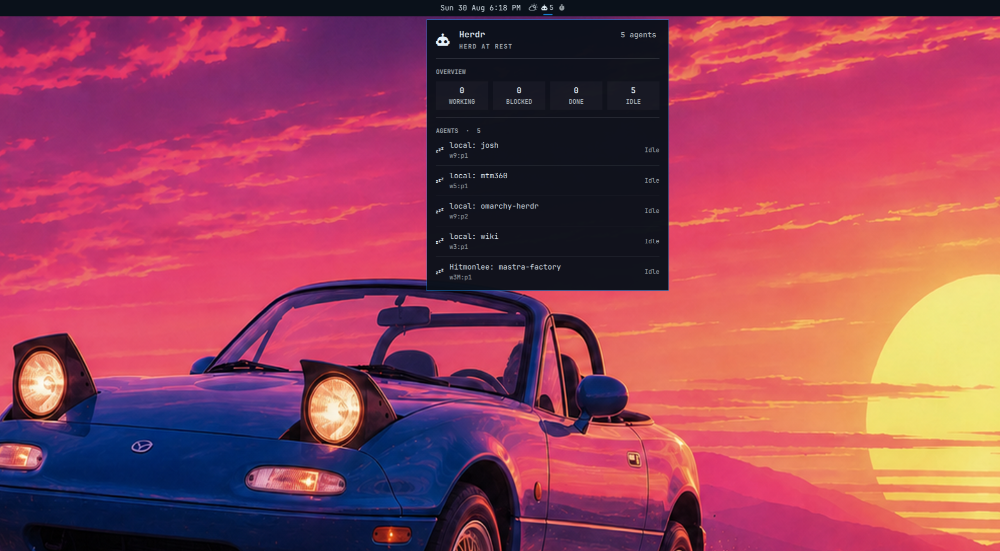

# Herdr for Omarchy

An Omarchy bar widget for monitoring [Herdr](https://herdr.dev) agents. It shows active or blocked agent counts in the bar and opens a detailed, keyboard-accessible panel with the status of every agent.



## Requirements

- Omarchy with the Quattro shell plugin system
- [Herdr](https://herdr.dev) available on `PATH`, with its server running
- `jq`
- GNU coreutils (`timeout`)
- OpenSSH when remote hosts are configured
- An Omarchy-compatible Nerd Font for the status icons

The plugin polls `herdr agent list` locally every three seconds. It also polls the SSH targets listed in `remote-hosts`. SSH polling uses batch mode and short timeouts, so an offline host or one that needs a password cannot stall the bar.

## Install

Review the source before installing. Omarchy plugins run as unsandboxed code inside the long-running shell process.

```bash
omarchy plugin add https://github.com/fabean/omarchy-herdr.git --enable
```

The widget is placed in the right bar section by default. If it was installed without `--enable`, enable it later:

```bash
omarchy plugin enable io.github.fabean.herdr --section right
```

## Use

- Left-click the widget to open or close the agent panel.
- Click an agent to focus its pane in Herdr. The plugin focuses an existing local or remote Herdr window and opens one when needed.
- Right-click the widget to refresh immediately.
- In the panel, press `R` or `Enter` to refresh and `Escape` to close.
- When Herdr is unavailable, the widget displays an offline indicator.

## Remote hosts

Add one SSH target per line to `remote-hosts` in the installed plugin directory. Targets may be hostnames, `user@host` values, or aliases from `~/.ssh/config`.

```text
# ~/.config/omarchy/plugins/io.github.fabean.herdr/remote-hosts
Hitmonlee
user@192.0.2.10
```

Set up key-based SSH authentication first. The widget never opens an SSH password prompt.

When at least one remote is configured, agent names are prefixed with their source, such as `local: api` or `Hitmonlee: worker`. Without remote hosts, local agent names are shown without a prefix.

## Update

```bash
omarchy plugin update io.github.fabean.herdr
```

## Remove

```bash
omarchy plugin remove io.github.fabean.herdr
```

Removal deletes only the plugin checkout and removes the widget from the Omarchy bar configuration. It does not remove Herdr or its data.

## Develop

Validate the plugin against the installed Omarchy manifest schema:

```bash
omarchy plugin validate .
```

For local testing, install from a local Git remote or copy the repository into `~/.config/omarchy/plugins/io.github.fabean.herdr` and rescan plugins.

## License

[MIT](LICENSE)
